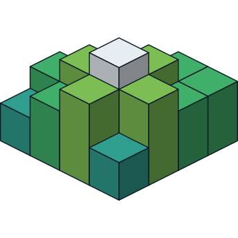
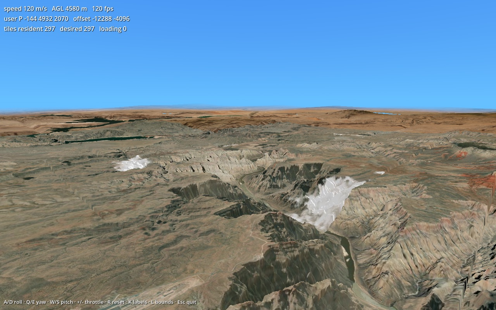
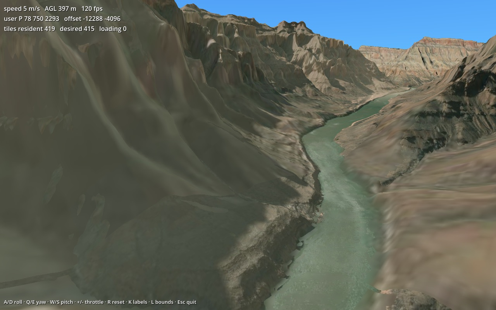
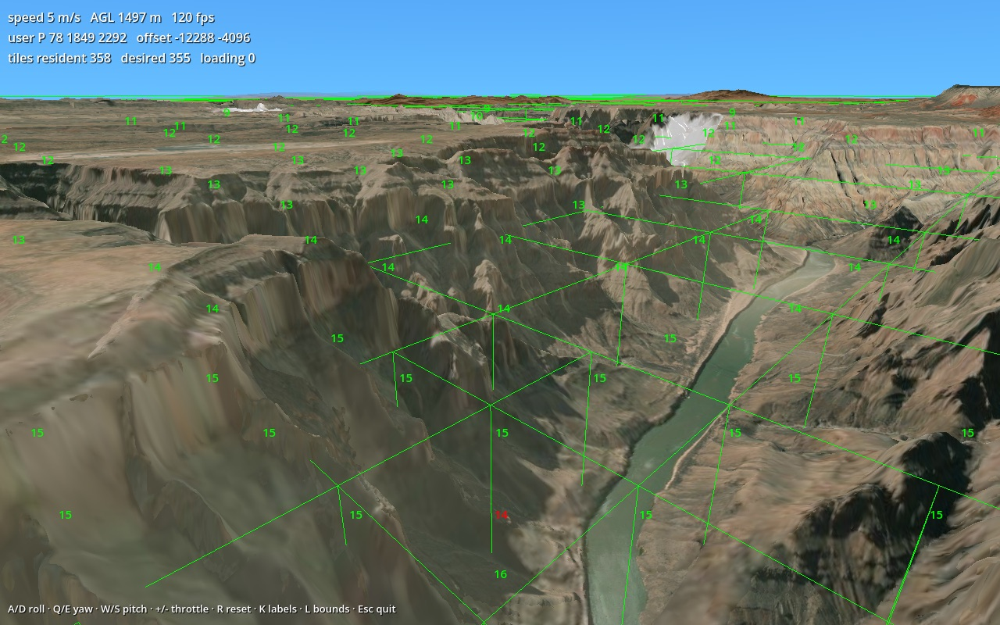

<div align="center">
    
    <br />
    <h1>Godotiles</h1>
    <strong>3D geospatial engine for Godot 4</strong>
    <br />
    <br />
</div>

[](https://github.com/ziv/godotiles/actions/workflows/linux.yml)
[](https://github.com/ziv/godotiles/actions/workflows/macos.yml)
[](https://github.com/ziv/godotiles/actions/workflows/windows.yml)

**Godotiles** is a 3D geospatial engine 🌎 for [Godot 4](https://godotengine.org/). Designed to
stream and render the real world in real time, it lets you visualize any location on Earth
directly inside your Godot games and applications.

Built for indie developers and professionals alike, Godotiles is a perfect fit for UAV
simulations, flight-planning software, lightweight GIS analysis, presentations, digital sand
tables, and any other geospatial visualization.

It provides precise, ground-truth altitude data, essential for accurate collision detection and
spawning mechanics in games, as well as for topographical analysis in GIS workflows.

Godotiles is the Godot port of [raytiles](https://github.com/ziv/raytiles) (raylib) and
[bevytiles](https://github.com/ziv/bevytiles) (Bevy): a Rust GDExtension with the same tile
cache format, LOD policy and defaults.

## Features

- Streaming and rendering **any** location on Earth
- Adaptive quadtree **LOD**, zoom 9–22 (terrain synthesized above the providers' native zoom)
- **Lights and shadows** via normal maps, distance fog matched to your sky
- Ground-truth **altitude queries** for collision and spawning
- Configurable and **provider agnostic** (Esri / Mapbox imagery, Mapzen Terrarium elevation)
- Background downloading on worker threads with a persistent, resumable **on-disk cache**
- Large-world shifting for float-precision-safe worlds of any size
- Prebuilt binaries for **macOS, Linux and Windows**; usable from GDScript and C#
- Open source, MIT / Apache-2.0

## Screenshots

| cruise over the Grand Canyon | 400 m AGL (synthesized z16–17 terrain) | debug overlay (K / L) |
|---|---|---|
|  |  |  |

## Run the demo

Requires Godot 4.4+ (developed on 4.7) and a Rust toolchain.

```sh
scripts/build.sh release        # builds the extension into addons/godotiles/bin/<platform>/
godot --path .                  # or open the project in the editor and press Play (addons/godotiles/demo/main.tscn)
```

Flies over the Grand Canyon. **A/D** roll, **Q/E** yaw, **W/S** pitch, **+/-** throttle, **R**
reset after crashing into the terrain, **K** zoom labels, **L** tile bounds. Tiles cache under
`.cache/`; the first run downloads them.

## Use in your project

Copy `addons/godotiles/` (with the `bin/` folder from a
[release](https://github.com/ziv/godotiles/releases) or from `scripts/build.sh`) into your
project. No plugin activation is needed — the classes are registered by the GDExtension. The addon folder also carries the
demo (`addons/godotiles/demo/`) — delete it if you do not want it in your project.

```gdscript
extends Node3D

func _ready() -> void:
    var terrain := TerrainStreamer.new()
    terrain.world = TerrainWorldConfig.from_lat_lon(46.206889, 9.497194)  # the Dolomites
    terrain.rendering.fog_color = Color8(102, 191, 255)                    # match your sky
    terrain.camera_path = $Camera3D.get_path()
    add_child(terrain)

    $Camera3D.near = 1.0
    $Camera3D.far = 400000.0     # see to the horizon (the inspector caps at 4000; code does not)
    $Camera3D.position = terrain.initial_position(5000.0)
    $Camera3D.look_at($Camera3D.position + Vector3(-1000, -300, -1000), Vector3.UP)
```

Configuration is four resources on the node — `world`, `streaming`, `rendering`
(runtime-mutable), `network` — mirroring raytiles' `config`. `world.max_zoom` defaults to 15;
raising it (≤ 22) opts into heightmaps synthesized from the native-zoom ancestors and flat
default normals. Queries: `ground_height(pos)` (a float, or `null` when no tile covers the
point), `is_loading` / `loading_progress` for a splash screen, `get_resident_tiles()` for debug
overlays. Large worlds use the raytiles rebase convention via `world_offset`
(`absolute = user − world_offset`); see `addons/godotiles/demo/demo.gd`.

See [`plan.md`](plan.md) for the full design: coordinate spaces, the frame loop, the LOD policy,
the tile lifecycle, the shader, and the list of traps.

## Layout

| path | role |
|---|---|
| `rust/src/core/` | engine-agnostic core (no Godot types): config, LOD policy, synthesis, height grids, frustum, source (worker pool + HTTP + disk cache), tile lifecycle store |
| `rust/src/godot/` | the Godot shell: `TerrainStreamer` node, config resources, GPU resources |
| `rust/shaders/terrain.gdshader` | displacement, lighting, fog (embedded into the binary) |
| `addons/godotiles/` | the distributable addon |
| `addons/godotiles/demo/` | the demo scenes and scripts (ship with the addon) |
| `tests/godot/` | headless smoke test (`godot --headless --path . -s tests/godot/smoke.gd`) |
| `scripts/` | build script, cache pre-warmer (`node scripts/tiles-cache.mjs <x> <y>`) |

## Notes

- Data: imagery © Esri; elevation / normals from the Mapzen / AWS terrain tiles. Mind their
  terms. Set `network.texture_url` to a Mapbox template with your token for Mapbox imagery.
- `cargo test --manifest-path rust/Cargo.toml` runs the full suite (LOD snapshots identical to
  the C++ and Bevy engines, synthesis math, store policy, source integration against seeded
  caches — all offline).
- macOS: an unsigned download may need `xattr -dr com.apple.quarantine addons/godotiles/bin/macos`.

## License

- Apache License, Version 2.0 ([LICENSE-APACHE](LICENSE-APACHE) or https://www.apache.org/licenses/LICENSE-2.0)
- MIT license ([LICENSE-MIT](LICENSE-MIT) or https://opensource.org/licenses/MIT)
